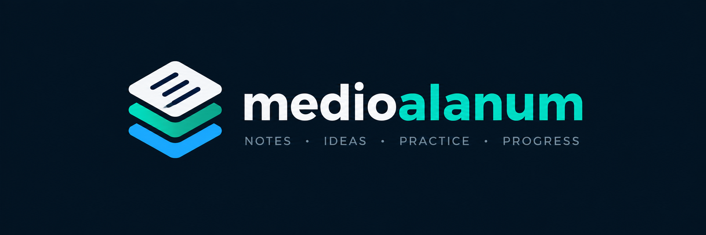

<p align="center">
  
</p>

<p align="center"><em>Notes on Python, APIs, data, and software engineering.</em></p>

<p align="center">
  <a href="https://medioalanum.github.io/"></a>
  <a href="https://github.com/medioalanum/medioalanum.github.io/actions/workflows/deploy.yml"></a>
</p>

Personal notes on Python, APIs, data, and software engineering.

Read the blog at [medioalanum.github.io](https://medioalanum.github.io/).

The site is generated with [Pelican](https://getpelican.com/), managed with
[uv](https://docs.astral.sh/uv/), styled with a locally maintained version of
the [Elegant](https://github.com/Pelican-Elegant/elegant) theme, and deployed
to GitHub Pages through GitHub Actions.

## Requirements

- [Git](https://git-scm.com/)
- [uv](https://docs.astral.sh/uv/getting-started/installation/)

Python is installed automatically by `uv` based on `.python-version`.

## Local development

Clone the repository and install the locked dependencies:

```bash
git clone --recurse-submodules https://github.com/medioalanum/medioalanum.github.io.git
cd medioalanum.github.io
uv sync --locked
```

If the repository was cloned without submodules, initialize the theme with:

```bash
git submodule update --init --recursive
```

Start Pelican with automatic rebuilding enabled:

```bash
uv run pelican --autoreload --listen
```

Open [localhost:8000](http://localhost:8000/) in a browser.

## Writing a post

Create a Markdown file in `content/`. Use a descriptive lowercase filename,
such as `content/my-new-post.md`, and begin it with Pelican metadata:

```markdown
Title: My New Post
Date: 2026-08-26 10:00
Category: Software Engineering
Tags: Python, tooling
Slug: my-new-post
Summary: A short description used in feeds and article listings.

Write the article here.
```

Keep the metadata and article content in English. Leave one blank line between
the metadata and the body. The `Slug` becomes the article URL, for example
`https://medioalanum.github.io/my-new-post/`.

## Production build

Build the site with absolute production URLs:

```bash
uv run --locked pelican content -s publishconf.py
```

Generated files are written to `output/`. This directory is ignored by Git
because GitHub Actions generates it again for every deployment.

## Publishing

Push changes to `main`:

```bash
git add .
git commit -m "Publish my new post"
git push
```

The deployment workflow builds the production site and publishes it to GitHub
Pages automatically. Its progress is available in the repository's
[Actions](https://github.com/medioalanum/medioalanum.github.io/actions) tab.

## Project structure

```text
content/          Markdown articles
themes/elegant/   Elegant theme Git submodule
pelicanconf.py    Local development settings
publishconf.py    Production settings
output/           Generated site, not committed
```
